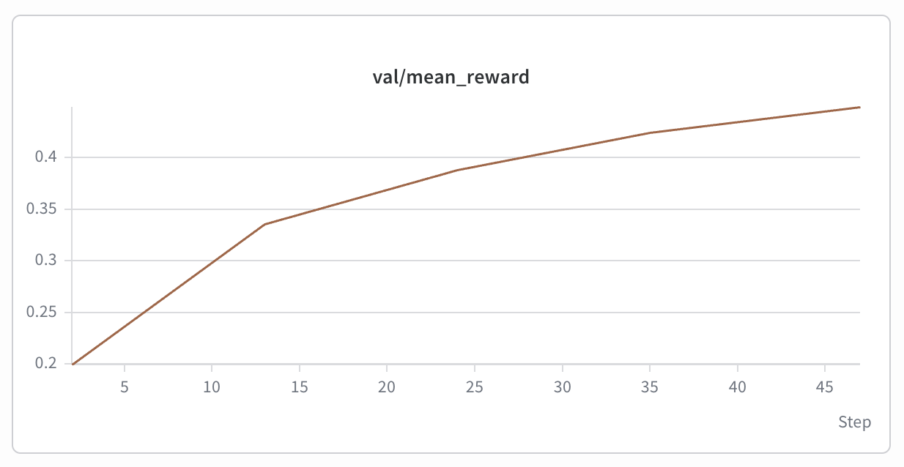
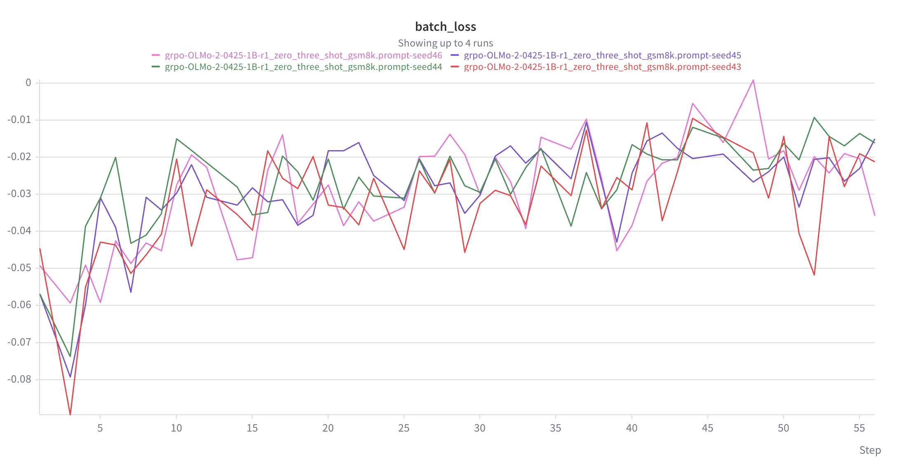
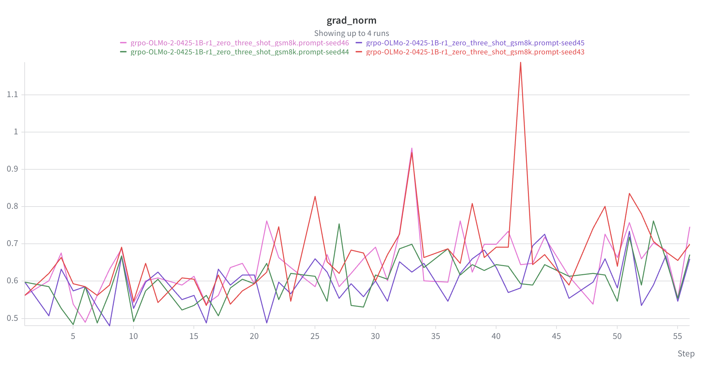
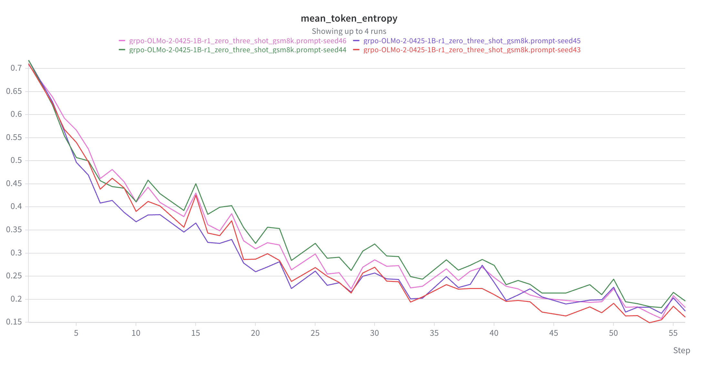
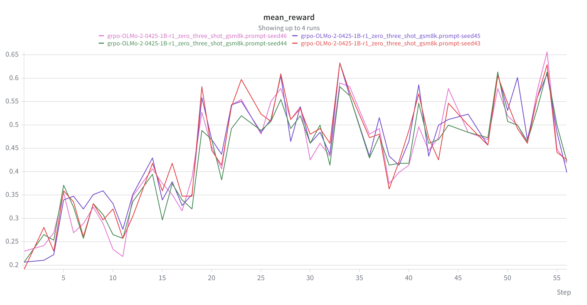
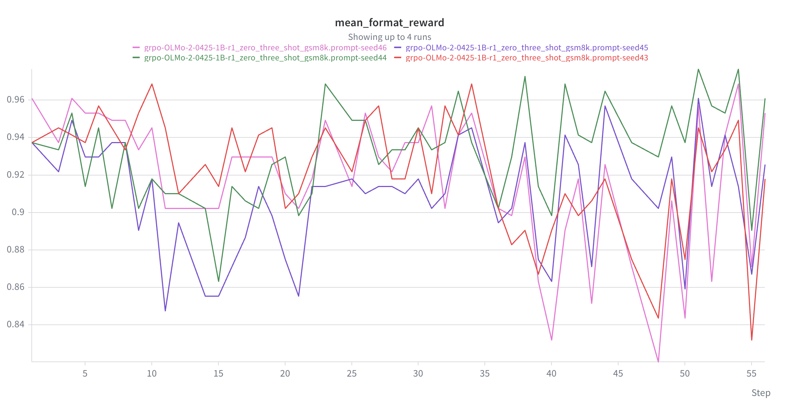
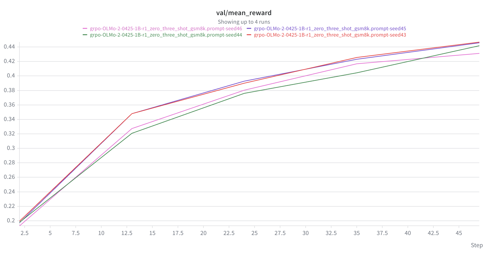
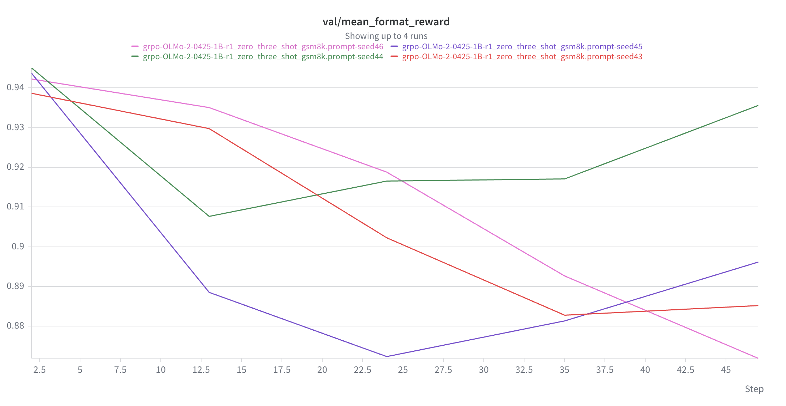
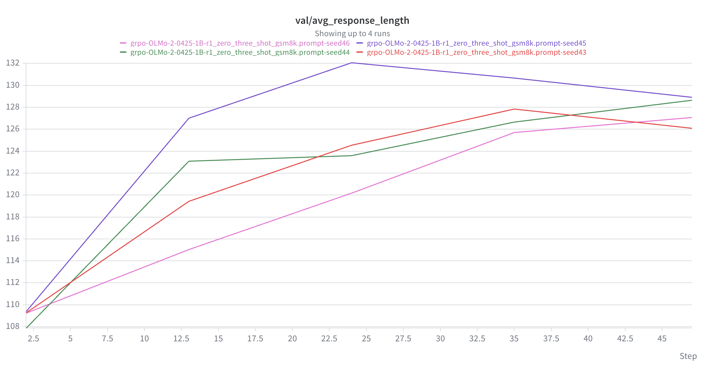

# Problem (prompting_baselines)

(a)
Question-only:
* Format=1, Correctness=1: 2
* Format=1, Correctness=0: 203
* Format=0, Correctness=0: 1114

R1-zero:
* Format=1, Correctness=1: 0
* Format=1, Correctness=0: 795
* Format=0, Correctness=0: 524

R1-zero 3-shot:
* Format=1, Correctness=1: 224
* Format=1, Correctness=0: 1050
* Format=0, Correctness=0: 45

Observed 10 examples of format reward 1 and correctness reward 0, and 1/10 of them the model output was actually correct but just not parsed correctly.

Example:
* Question: James decides to run 3 sprints 3 times a week.  He runs 60 meters each sprint.  How many total meters does he run a week?
* Ground truth: 540
* Completion: He walks at a speed of 5 m/sec. </think> <answer> He would run 3 * 3 = 9 sprints in a week, totaling 9 * 60 = 540 meters. </answer>

Observed 10 examples of format reward 0 and correctness reward 0, and similarly 1/10 of them the model output was correct but not parsed correctly.

Example:
* Question: A robe takes 2 bolts of blue fiber and half that much white fiber.  How many bolts in total does it take?
* Ground truth: 3
* Completion: A robe takes 2 bolts of blue fiber and half that much white fiber. So, a robe takes 2 + (2 / 2) = 3 bolts of fiber in total.</think> <answer> It takes 3 bolts of fiber in total.</answer>

(b) It is not enough to just provide the question to the model (question_only prompt). Many times, the model simply continues the question, and outputs "Remember students don’t have to use any variable to compute in their answers" or "What's the final answer?".

For r1_zero prompts, many times the model doesn't actually think about the question presented to it, but instead some other random GSM8K-style problem. 

The model does the best for r1_zero_three_shot prompts. The model's completion and thinking step is now grounded in the actual question since it was presented with few-shot examples.

# Problem (grpo_experiments_standard_on_policy)

(a) See grpo_experiments.py

(b) Ran it for 50 steps using r1 zero three shot prompt. The r1 zero prompt never seems to get any correct answers so all rewards are always 0; the model is unable to learn.

Rollouts also look reasonable.

Example of incorrect rollout:

* Q: Janet’s ducks lay 16 eggs per day. She eats three for breakfast every morning and bakes muffins for her friends every day with four. She sells the remainder at the farmers' market daily for $2 per fresh duck egg. How much in dollars does she make every day at the farmers' market?
* A: Janet’s ducks lay 16 eggs per day. She eats 3 eggs for breakfast, so that leaves 16 - 3 = 13 eggs. She bakes muffins for her friends with 4 eggs each, which means she bakes 4 * 2 = 8 muffins. So she has 13 - 8 = 5 eggs left to sell. At $2 per duck egg, she makes 5 * 2 = $10 every day at the farmers' market. </think> <answer> 10 </answer>

Example of correct rollout:

* Q: A robe takes 2 bolts of blue fiber and half that much white fiber.  How many bolts in total does it take?
* A: A robe takes 2 bolts of blue fiber. It takes half that much white fiber, which is 2 / 2 = 1 bolt. So in total, it takes 2 + 1 = 3 bolts. </think> <answer> 3 </answer>

(c)
Batch loss.

Gradient norm increasing from ~0.55 to ~0.65 with occasional spikes to ~1 indicates that the magnitude of the policy updates is gradually increasing over time. Some rollout batches produce unusually strong learning signals.

Decreases from 0.7 to 0.2. The model becomes more deterministic in its predictions / responses.

Increase from 0.2 to 0.5, then seems to oscillate. Noisy since it's per-step batches.

Very noisy.

Monotonic increase for val mean reward.

Seems to be a slight decreasing trend for val mean format reward.

Average response length increases across all 4 seeds. Perhaps the longer responses are causing higher chances of formatting incorrectly?

Looking at a few examples of rollouts before and after training, I see that before training the model averages ~2/8 samples correct, but at the end of training the model averages ~6/8 samples correct. The reasoning also became much more coherent, with the model improving from obvious reasoning failures to systematically decomposing the problem.

